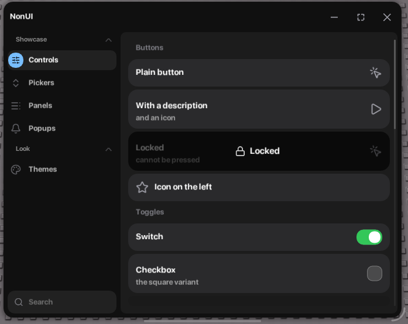

# NonUI



## Load

```lua
local Non = loadstring(game:HttpGet("https://raw.githubusercontent.com/neaxusxgod-png/NonUI/main/NonUI.lua"))() or NonUI
```

## Start

```lua
local Window = Non:CreateWindow({ Title = "My hub", Folder = "MyHub", Theme = "Dark" })
local Main = Window:Section({ Title = "Main" })
local Home = Main:Tab({ Title = "Home", Icon = "grid-2x2" })

Home:Toggle({ Title = "Aimbot", Flag = "aim", Callback = function(on) print(on) end })
Home:Slider("Field of view", 10, 360, 120)
Home:Select()
```

Full file: [example.lua](example.lua)

## Elements

`Button` `Toggle` `Slider` `Dropdown` `Input` `Keybind` `Colorpicker` `Paragraph` `Progressbar` `Code` `Divider` `Section` `Space` `Group` `Image` `Tag`

Every one takes a table, or just a title:

```lua
Tab:Toggle("Speed")
Tab:Slider("Speed", 0, 100, 50, function(v) end)
```

Sliders take `Min` `Max` `Default` `Step` `Rounding` `Suffix` `Icons` `IsTextbox`.
Toggles take `Type = "Checkbox"`. Dropdowns take `Multi` `SearchBarEnabled` `AllowNone` `MenuWidth`.
Keybinds take `Mode` `CanChange` `Blacklist`. Any element takes `Desc` `Icon` `IconAlign` `Locked` `Size` `Tags` `Flag`.

Every one gives you the same methods:

```lua
piece:Set(value)
piece:Get()
piece:SetTitle("New")
piece:SetDesc("or nil")
piece:SetVisible(false)
piece:SetLocked(true)
piece:SetIcon("star")
piece:OnChanged(function(v) end)
piece:Destroy()
```

## Flags

```lua
Non:Get("aim")
Non:Set("aim", true)
Non:Watch("aim", function(v) end)
Non.Flags
```

`Set` moves the element too, not just the value.

## Window

```lua
Non:CreateWindow({
    Title = "My hub",
    Icon = "star",              -- name, url, file or base64
    Author = "by me",
    Folder = "MyHub",
    Theme = "Dark",
    Size = { 620, 480 },
    MinSize = { 420, 320 },
    MaxSize = { 1600, 1000 },
    Transparency = 0.2,
    SideBarWidth = 200,
    Resizable = true,
    HideSearchBar = false,
    HidePanelBackground = false,
    Topbar = { ButtonsType = "Mac", Height = 52 },
    User = { Title = "Guest", Desc = "not signed in" },
    Footer = "my hub",
    OpenButton = { Title = "Open", OnlyIcon = false, Draggable = true, Scale = 1 },
})
```

Methods: `Tab` `Section` `Select` `Open` `Close` `Toggle` `Minimise` `Fullscreen` `Destroy` `Popup` `Element` `CreateConfig` `GetConfig` `SetUIScale` `SetToggleKey` `SetPanelBackground` `SetLogo` `EditOpenButton`

## Config

```lua
local config = Window:CreateConfig("default")
config:Save("default")
config:Load("default")
config:Delete("default")
config:AllConfigs()
config:SetAutoLoad("default")
config:GetAutoLoadConfig()
config:LoadAutoLoad()
config:ClearAutoLoad()
```

Saves everything that has a `Flag` into `NonUI/<Folder>/<name>.json`.

## Themes

16 of them: Dark, Light, Rose, Plant, Red, Indigo, Sky, Violet, Amber, Emerald, Midnight, Crimson, MonokaiPro, CottonCandy, Mellowsi, Rainbow.

```lua
Non:SetTheme("Rose")
Non:GetThemes()
Non:AddTheme("Mine", { Accent = Color3.fromHex("#18181b"), Text = Color3.new(1, 1, 1) })
Non:SetTransparency(0.3)
Non:GetTransparency()
```

## Other

```lua
Non:Notify({ Title = "Saved", Content = "config", Icon = "check", Duration = 4 })
Non:Bind("f5", function() end)
Non:Unload()
```

Dialogs:

```lua
Window:Popup({
    Title = "Close?",
    Content = "you can open it again",
    Buttons = {
        { Title = "Stay" },
        { Title = "Close", Variant = "Primary", Callback = function() Window:Close() end },
    },
})
```

## Icons and logo

62 lucide icons are built in. Pass the name:

```lua
Tab:Button({ Title = "Save", Icon = "download" })
```

Anywhere an icon is taken you can pass your own picture instead. Four forms, all the same field:

```lua
Icon = "star"                                   -- built in name
Icon = "https://site.com/logo.png"              -- url
Icon = "MyHub/logo.png"                         -- file on disk
Icon = "iVBORw0KGgoAAAANSUhEUgAA..."            -- base64 png
```

Works for the window logo, tab icons, element icons, slider icons, notification icons, dialog icons and the user card.

```lua
Non:CreateWindow({ Icon = "https://site.com/logo.png" })
Window:SetLogo("MyHub/logo.png")
Tab:Button({ Title = "Discord", Icon = "https://site.com/discord.png" })
```

Built in names take the theme colour. Your own picture keeps its own. Png only.
